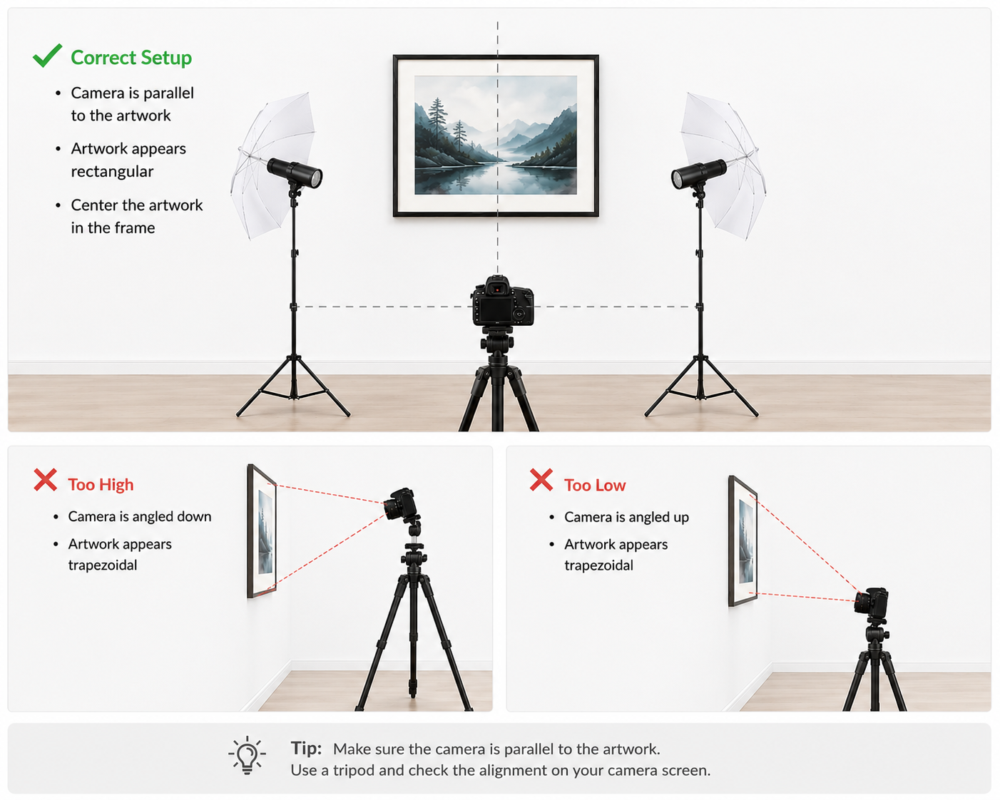

# How to Digitize Traditional Artwork for High-Quality Prints
In this beginner-friendly guide, you will learn how to create a high-quality digital version of traditional artwork for printing. The guide is for artists who want to reproduce their artwork as prints or use it for print-on-demand services.

After completing this guide, you will be able to:

* Choose an appropriate digitization method for your artwork.
* Create a sharp, print-ready digital image.
* Crop and straighten the image.
* Adjust the colors to match the original artwork as closely as possible.
* Export a file that meets the requirements of your printer or print-on-demand service.

This guide covers scanning and photographing artwork. It does not cover camera or printer purchases, advanced color management, print production, or selling prints.

## What You Need
The exact requirements depend on whether you choose to scan or photograph the artwork. For help selecting a method, see [Choose a Digitization Method](#choose-a-digitization-method). 

Most artists will need the following:

* Original artwork
* A scanner or digital camera
* A computer
* Image editing software, such as a built-in photo editor
* Adequate lighting or a sheltered outdoor space
* Sufficient storage space for image files
  
Optional but recommended:

* A tripod for camera stability

## Choose a Digitization Method
Traditional artwork can be digitized using either a scanner or a digital camera. The best method depends on the size and surface of the artwork. 

### Use a Scanner

A scanner is often the best choice when:

* The artwork is smaller than the scanner bed
* The artwork is on paper
* The artwork has a flat surface
* You want a simple setup with consistent lighting

Scanners are commonly used for watercolor paintings, drawings, and other flat artwork.

### Use a Camera
A camera is often the best choice when:

* The artwork is too large for a scanner
* The artwork is painted on canvas
* The artwork has visible texture
* You want to capture surface details

Cameras are commonly used for acrylic and oil paintings, especially on stretched canvas. A dedicated camera generally provides greater control and image quality, but many modern smartphones are capable of producing files suitable for small and medium-sized prints.

### Comparison
The following table compares the two digitization methods.

| Factor | Scanner | Camera |
|--------|---------|--------|
| Best for | Small, flat artwork | Large or textured artwork |
| Lighting | Built-in and consistent | Must be controlled manually |
| Surface detail | Limited | Better for texture |
| Setup difficulty | Simple | Requires more setup |
| Common use cases | Watercolor, drawings, ink | Acrylic, oil, canvas |

If both methods are available, choose the method that best matches the size and surface of your artwork.

## Photograph the Artwork
Follow these steps to create a high-quality digital image of your artwork. Good lighting is essential for creating high-quality images with accurate colors. For a more detailed studio lighting setup, see [How to photograph your artwork using studio lighting](https://www.aapgh.org/blog/photography-tips). 

Many artists prefer to photograph artwork outdoors. For the best results, choose a shaded location or photograph on a cloudy day to achieve even lighting and reduce glare. 

Use the following steps to photograph your artwork:

### 1. Prepare the Artwork
Place the artwork in a location with even lighting. Remove any dust, dirt, or loose debris from the surface.

For the best results, position the artwork vertically on a wall or easel.

### 2. Set Up the Lighting
Use bright, even lighting across the entire artwork. Avoid direct sunlight, which can create glare and uneven shadows. If possible, use two light sources positioned on either side of the artwork.

### 3. Position the Camera
Mount the camera on a tripod and place it directly in front of the artwork. Make sure the camera faces the artwork directly. Tilting the camera can distort the image and make the artwork appear trapezoidal instead of rectangular.

The image below demonstrates a correct camera setup.

  

  <em>Figure 1. Keep the camera parallel to the artwork to avoid perspective distortion.</em>

Use the highest available resolution setting. Do not use digital zoom, as this reduces image quality.

Adjust the camera distance so that the artwork fills most of the frame while remaining fully visible. Leave a small margin around the edges to avoid accidentally cropping part of the artwork.

### 4. Capture the Image
Focus carefully on the artwork and take several photographs.

Review the images on your camera or computer. Check for blur, glare, shadows, and make sure the artwork is fully visible and correctly framed.

### 5. Select the Best Image
Choose the sharpest image with the most accurate colors and even lighting.

If necessary, crop the image to remove the background and align the edges of the artwork.

> Tip: Take multiple photographs even if the first image looks good. Small differences in focus and lighting can significantly affect print quality.

## Scan the Artwork
The scanning process depends on the type of scanner and scanning software you use. In most cases, you use a computer program to adjust the scan settings and start the scan.

> Note: This section describes the general scanning process. Your scanner software may use different names for the same settings.

Follow these steps to scan your artwork:

### 1. Prepare the Artwork
Make sure the artwork is clean and dry before placing it on the scanner bed. Align the artwork with the edge of the scanner to make cropping easier.

### 2. Adjust the Scan Settings
Choose a high-resolution setting. For most print use, scan at 300 DPI (dots per inch) or higher. Use 600 DPI if you plan to enlarge the artwork or capture fine details.

Save the working file as TIFF, PNG, or another low-compression format. Avoid using heavily compressed JPEG files as your main editing file. 

If your scanner software has a preview feature, use it to check that the artwork is fully visible and correctly positioned.

### 3. Scan the Artwork
Start the scan and review the image on your computer. Check that the image is sharp and free from visible dust or streaks.

## Edit the Image
After digitizing the artwork, use image editing software to prepare the file for printing. Most computers include a basic photo editor that you can use for simple adjustments. For more control, use professional software such as Adobe Photoshop, Affinity Photo, or GIMP.

Use the software to make the following adjustments:

* Crop the image to remove the background.
* Straighten the artwork if needed.
* Adjust brightness, contrast, and color balance.
* Remove dust, spots, or unwanted marks.

After editing, check that the image matches the original artwork as closely as possible. Avoid making changes that alter the artwork itself. The goal is to create an accurate digital version of the original, not to improve or reinterpret it.

## Export the File
Before printing, check the file requirements for your printer or print-on-demand service. Requirements may include image size, resolution, file format, and color profile.

Save a copy of the edited working file before exporting the final file. This lets you make changes later without editing the original scan or photograph.

## Troubleshooting

Use this section to solve common problems after scanning or photographing your artwork.

| Problem | Possible cause | Solution |
|----------|----------------|----------|
| The image looks blurry | The camera moved, the focus was incorrect, or the scanner glass was dirty. | Use a tripod, check the focus, or clean the scanner glass and try again. |
| The colors do not match the original artwork | The lighting, white balance, display settings, or scan settings may affect the colors. | Use even lighting, avoid direct sunlight, and adjust brightness, contrast, and color balance during editing. |
| The artwork looks distorted | The camera was tilted instead of facing the artwork directly. | Retake the photo with the camera parallel to the artwork. See [Position the Camera](#3-position-the-camera). |
| The image has glare or reflections | Direct light or flash reflected off the artwork surface. | Use soft, even lighting from the sides and avoid using flash. |
| The image has dust, spots, or marks | Dust was present on the artwork, scanner glass, or camera lens. | Clean the artwork and equipment before digitizing. Remove small marks during editing if needed. |
| Part of the artwork is cropped | The artwork was too close to the edge of the frame or scanner area. | Leave a small margin around the artwork and crop the image later during editing. |
| The file quality is too low for printing | The image was captured or saved at a low resolution. | Use a higher resolution setting and avoid heavily compressed files when possible. |
| The image looks too dark or too bright | The exposure or lighting was incorrect. | Retake the photo with more even lighting, or adjust exposure during editing. |
| The paper texture is too visible | The lighting angle emphasized the paper surface. | Try softer, more even lighting or scan the artwork instead. |
